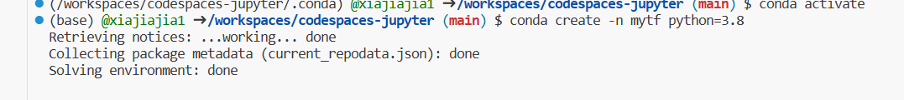

# 实验5.1：使用TensorFlow Lite Model Maker生成图像分类模型

## 一、使用codespace，安装相关库

首先，创建3.8的conda虚拟环境

激活刚才创建的虚拟环境
！[](./photo/2.png)
在改虚拟环境下，安装TF运行所需基本库


## 二、导入相关库：


```python
import os

import numpy as np

import tensorflow as tf
assert tf.__version__.startswith('2')

from tflite_model_maker import model_spec
from tflite_model_maker import image_classifier
from tflite_model_maker.config import ExportFormat
from tflite_model_maker.config import QuantizationConfig
from tflite_model_maker.image_classifier import DataLoader

import matplotlib.pyplot as plt
```

在导入相关库时遇见如下问题：
1.找不到libusb-1.0-0  
  解决：先sudo apt update后，  
  再sudo apt install libusb-1.0-0-dev下载该库

## 三、训练模型
### 获取数据
先从storage.googleapis.com中下载了本实验所需要的数据集。image_path可以定制，默认是在用户目录的.keras\datasets中。


```python
image_path = tf.keras.utils.get_file(
      'flower_photos.tgz',
      'https://storage.googleapis.com/download.tensorflow.org/example_images/flower_photos.tgz',
      extract=True)
image_path = os.path.join(os.path.dirname(image_path), 'flower_photos')

```

### 运行示例
此步骤一共有四步
①：加载数据集，并将数据集分为训练数据和测试数据。


```python
data = DataLoader.from_folder(image_path)
train_data, test_data = data.split(0.9)

```

    INFO:tensorflow:Load image with size: 3670, num_label: 5, labels: daisy, dandelion, roses, sunflowers, tulips.
    

    INFO:tensorflow:Load image with size: 3670, num_label: 5, labels: daisy, dandelion, roses, sunflowers, tulips.
    

②：第二步：训练Tensorflow模型


```python
model = image_classifier.create(train_data)

```

    INFO:tensorflow:Retraining the models...
    

    INFO:tensorflow:Retraining the models...
    

    Model: "sequential_1"
    _________________________________________________________________
     Layer (type)                Output Shape              Param #   
    =================================================================
     hub_keras_layer_v1v2_1 (Hub  (None, 1280)             3413024   
     KerasLayerV1V2)                                                 
                                                                     
     dropout_1 (Dropout)         (None, 1280)              0         
                                                                     
     dense_1 (Dense)             (None, 5)                 6405      
                                                                     
    =================================================================
    Total params: 3,419,429
    Trainable params: 6,405
    Non-trainable params: 3,413,024
    _________________________________________________________________
    None
    Epoch 1/5
    103/103 [==============================] - 80s 755ms/step - loss: 0.8421 - accuracy: 0.7782
    Epoch 2/5
    103/103 [==============================] - 77s 751ms/step - loss: 0.6534 - accuracy: 0.9038
    Epoch 3/5
    103/103 [==============================] - 76s 740ms/step - loss: 0.6242 - accuracy: 0.9123
    Epoch 4/5
    103/103 [==============================] - 74s 718ms/step - loss: 0.6001 - accuracy: 0.9287
    Epoch 5/5
    103/103 [==============================] - 74s 720ms/step - loss: 0.5884 - accuracy: 0.9333
    

③：评估模型


```python
loss, accuracy = model.evaluate(test_data)

```

    12/12 [==============================] - 11s 679ms/step - loss: 0.6425 - accuracy: 0.8937
    

④：导出模型


```python
model.export(export_dir='.')
```

    INFO:tensorflow:Assets written to: /tmp/tmp6rjh8e4_/assets
    

    INFO:tensorflow:Assets written to: /tmp/tmp6rjh8e4_/assets
    2023-05-29 11:30:45.795150: I tensorflow/core/grappler/devices.cc:66] Number of eligible GPUs (core count >= 8, compute capability >= 0.0): 0
    2023-05-29 11:30:45.799654: I tensorflow/core/grappler/clusters/single_machine.cc:358] Starting new session
    2023-05-29 11:30:45.866523: I tensorflow/core/grappler/optimizers/meta_optimizer.cc:1164] Optimization results for grappler item: graph_to_optimize
      function_optimizer: Graph size after: 913 nodes (656), 923 edges (664), time = 37.567ms.
      function_optimizer: function_optimizer did nothing. time = 0.027ms.
    
    /opt/conda/envs/mytf/lib/python3.8/site-packages/tensorflow/lite/python/convert.py:746: UserWarning: Statistics for quantized inputs were expected, but not specified; continuing anyway.
      warnings.warn("Statistics for quantized inputs were expected, but not "
    2023-05-29 11:30:46.916487: W tensorflow/compiler/mlir/lite/python/tf_tfl_flatbuffer_helpers.cc:357] Ignored output_format.
    2023-05-29 11:30:46.916578: W tensorflow/compiler/mlir/lite/python/tf_tfl_flatbuffer_helpers.cc:360] Ignored drop_control_dependency.
    

    INFO:tensorflow:Label file is inside the TFLite model with metadata.
    

    fully_quantize: 0, inference_type: 6, input_inference_type: 3, output_inference_type: 3
    INFO:tensorflow:Label file is inside the TFLite model with metadata.
    

    INFO:tensorflow:Saving labels in /tmp/tmpdid3xyri/labels.txt
    

    INFO:tensorflow:Saving labels in /tmp/tmpdid3xyri/labels.txt
    

    INFO:tensorflow:TensorFlow Lite model exported successfully: ./model.tflite
    

    INFO:tensorflow:TensorFlow Lite model exported successfully: ./model.tflite
    

这里导出的Tensorflow Lite模型包含了元数据(metadata),其能够提供标准的模型描述。导出的模型存放在Jupyter Notebook当前的工作目录中。如下：

## 四、测试新生成的模型
①：右击-->下载模型到本地  
②：删除原来的训练模型  
③：导入新的训练模型  
④：进行测试

